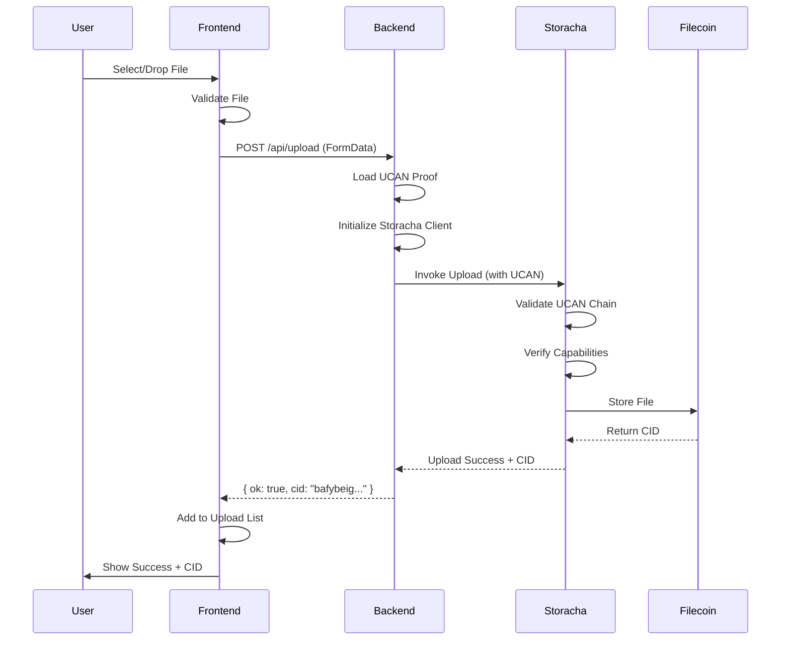

# 🔐 UCAN Upload Wall

A modern, decentralized file upload application powered by **User-Controlled Authorization Networks (UCANs)** and the **Storacha Network**. This project demonstrates how to build secure, token-free file storage using capability-based authorization instead of traditional API keys.


---

## 📋 Table of Contents

- [Overview](#overview)
- [Key Features](#key-features)
- [Architecture](#architecture)
- [Project Structure](#project-structure)
- [Getting Started](#getting-started)
- [How It Works](#how-it-works)
- [UCAN Flow Diagram](#ucan-flow-diagram)
- [Component Architecture](#component-architecture)
- [Development](#development)
- [Security](#security)
- [Contributing](#contributing)
- [Resources](#resources)
- [License](#license)

---

## 🌐 Overview

UCAN Upload Wall is a demonstration of decentralized file storage using **User-Controlled Authorization Networks (UCANs)**. Instead of relying on centralized API keys or bearer tokens, this application uses cryptographic capabilities to securely delegate upload permissions.

Files uploaded through this interface are stored on **Filecoin** via the **Storacha Network**, ensuring permanent, verifiable, and decentralized storage.

### What Makes This Different?

- **No API Keys**: Authorization is handled through UCAN proofs
- **Decentralized**: Files are stored on Filecoin via Storacha
- **Capability-Based**: Fine-grained permission delegation
- **Content Addressing**: Each file gets a unique CID (Content Identifier)
- **Cryptographically Secure**: All permissions are verified through UCAN chains

---

## ✨ Key Features

- 🎯 **Drag & Drop Upload**: Intuitive file upload interface
- 🔗 **Content Addressing**: Every file gets a unique CID
- 📋 **Upload History**: Track all uploaded files
- 📎 **Easy Sharing**: Copy CID or view files via IPFS gateway
- 🎨 **Modern UI**: Clean, responsive design with Tailwind CSS
- ⚡ **Fast**: Built with Vite for optimal performance
- 🔒 **UCAN Authorization**: Secure, token-free authentication
- 📱 **Responsive**: Works seamlessly on all devices

---

## 🏗️ Architecture

### High-Level Architecture

```
┌─────────────────────────────────────────────────────────────┐
│                        User Browser                         │
│                     (React + Vite App)                      │
└──────────────────────┬──────────────────────────────────────┘
                       │
                       │ HTTP Request (FormData)
                       ▼
┌─────────────────────────────────────────────────────────────┐
│                    Backend Server                           │
│              (Express + TypeScript)                         │
│                                                             │
│  ┌──────────────────────────────────────────────┐          │
│  │         UCAN Agent (DID + Private Key)        │          │
│  └──────────────────────────────────────────────┘          │
│                       │                                     │
│  ┌──────────────────────────────────────────────┐          │
│  │      Delegation Proof (space-proof.car)      │          │
│  │    Grants upload capabilities to agent      │          │
│  └──────────────────────────────────────────────┘          │
└──────────────────────┬──────────────────────────────────────┘
                       │
                       │ UCAN Invocation
                       ▼
┌─────────────────────────────────────────────────────────────┐
│                   Storacha Network                          │
│                                                             │
│  ┌────────────────────────────────────┐                    │
│  │   1. Validate UCAN Proof           │                    │
│  │   2. Verify Delegation Chain       │                    │
│  │   3. Check Capabilities            │                    │
│  └────────────────────────────────────┘                    │
└──────────────────────┬──────────────────────────────────────┘
                       │
                       │ Store File
                       ▼
┌─────────────────────────────────────────────────────────────┐
│                   Filecoin Storage                          │
│              (Permanent, Decentralized)                     │
│                                                             │
│           Returns: CID (Content Identifier)                 │
└─────────────────────────────────────────────────────────────┘
```

### UCAN Authorization Flow

```
┌──────────────┐
│  User Space  │  (Your Storacha namespace)
│   (DID:key)  │
└──────┬───────┘
       │
       │ Creates Delegation
       │ (storacha space create)
       ▼
┌─────────────────────────────────────────┐
│      UCAN Delegation Proof (.car)       │
│                                         │
│  Capabilities:                          │
│  - space/blob/add                       │
│  - store/add                            │
│  - upload/add                           │
│                                         │
│  Audience: Backend Agent DID            │
│  Expiration: Time-limited               │
└──────────────┬──────────────────────────┘
               │
               │ Agent Reads Proof
               ▼
┌─────────────────────────────────────────┐
│         Backend Agent                   │
│   Authorized to Upload on Your Behalf  │
└──────────────┬──────────────────────────┘
               │
               │ Invokes Upload
               ▼
┌─────────────────────────────────────────┐
│       Storacha Network                  │
│   Validates UCAN Chain & Executes       │
└─────────────────────────────────────────┘
```

---


## 📁 Project Structure

```
ucan-upload-wall/
├── src/
│   ├── components/
│   │   ├── Alert.tsx           # Toast notifications
│   │   ├── FileList.tsx        # Display uploaded files
│   │   ├── Header.tsx          # App header
│   │   └── UploadZone.tsx      # Drag & drop upload UI
│   │
│   ├── hooks/
│   │   └── useFileUpload.ts    # Upload logic & state
│   │
│   ├── types/
│   │   └── upload.ts           # TypeScript interfaces
│   │
│   ├── App.tsx                 # Main application
│   ├── main.tsx                # Entry point
│   └── index.css               # Global styles
│
├── public/                      # Static assets
├── dist/                        # Production build
│
├── .env                         # Environment variables
├── package.json                 # Dependencies
├── tsconfig.json                # TypeScript config
├── tailwind.config.js           # Tailwind config
├── vite.config.ts               # Vite config
└── README.md                    # This file
```

---

## 🚀 Getting Started

### Prerequisites

- **Node.js** ≥ 18.x
- **npm** or **yarn**
- Backend server running on `http://localhost:8787`

### Installation

1. **Clone the repository**

```bash
git clone https://github.com/Fatumayattani/ucan-upload-wall.git
cd ucan-upload-wall
```

### 2. Install dependencies

Install all required packages for the frontend.

```bash
npm install
```

---

### 3. Set up environment variables

Create a `.env` file in the root directory of your backend project and add the following values.
These connect your local server to your Storacha Space.

```bash
PORT=8080
KEY=PASTE_THE_PRIVATE_KEY_FROM_key_create
PROOF=PASTE_THE_BASE64_FROM_delegation_create
SPACE_DID=PASTE_THE_SPACE_DID_FROM_space_create
```

---

### 4. Start the development servers

First, run the frontend (from the `/web` folder):

```bash
npm run dev
```

This starts the UI on `http://localhost:5173`.

Then, open a new terminal window and run the backend (from the `/server` folder):

```bash
npm install
npm run dev
```

The backend will run on `http://localhost:8787`.

---

## 🔄 How It Works

### 1. User Interaction

The user drags and drops a file or clicks to select one from their device.

### 2. Frontend Preparation

The `useFileUpload` hook prepares the file and sends it to the backend via `FormData`:

```typescript
const formData = new FormData();
formData.append('file', file);

const response = await fetch('http://localhost:8787/api/upload', {
  method: 'POST',
  body: formData,
});
```

### 3. Backend Processing

The backend server:
1. Receives the file
2. Loads the UCAN delegation proof
3. Creates a Storacha client with the proof
4. Invokes the upload capability
5. Returns the CID (Content Identifier)

### 4. UCAN Validation

Storacha Network validates:
- The UCAN proof signature
- The delegation chain
- The requested capability (upload permission)
- The proof expiration

### 5. Storage

If validated, the file is:
- Stored on Filecoin
- Assigned a unique CID
- Made available via IPFS gateways

### 6. Response

The frontend receives the CID and:
- Displays it in the file list
- Provides copy and view options
- Shows success notification

---

## 📊 UCAN Flow Diagram




---

## 🤝 Contributing

Contributions are welcome! Please follow these steps:

1. Fork the repository
2. Create a feature branch (`git checkout -b feature/amazing-feature`)
3. Commit your changes (`git commit -m 'Add amazing feature'`)
4. Push to the branch (`git push origin feature/amazing-feature`)
5. Open a Pull Request


---

## 📚 Resources

### UCAN & Storacha

- [Storacha Documentation](https://docs.storacha.network/)
- [UCAN Specification](https://github.com/ucan-wg/spec)
- [Storacha GitHub](https://github.com/storacha)
- [UCAN Working Group](https://github.com/ucan-wg)

### Technologies

- [React Documentation](https://react.dev/)
- [Vite Documentation](https://vitejs.dev/)
- [TypeScript Documentation](https://www.typescriptlang.org/)
- [Tailwind CSS](https://tailwindcss.com/)
- [IPFS Documentation](https://docs.ipfs.tech/)
- [Filecoin Documentation](https://docs.filecoin.io/)

### Related Projects

- [w3up](https://github.com/web3-storage/w3up) - Storacha client libraries
- [ucanto](https://github.com/web3-storage/ucanto) - UCAN implementation

---

## 📄 License

This project is licensed under the MIT License - see the [LICENSE](LICENSE) file for details.

---

## 👥 Contributors

| Name | Role | GitHub |
|------|------|--------|
| **Fatuma Yattani** | Lead Developer | [@Fatumayattani](https://github.com/Fatumayattani) |
| Storacha PLDG Community | Support & Guidance | - |

---

## 🌟 Acknowledgments

- **Storacha Team** for building an amazing UCAN-based storage platform
- **UCAN Working Group** for the specification
- **IPFS & Filecoin** communities for decentralized storage infrastructure
- **React & Vite** teams for excellent developer tools

---

## 📧 Contact

For questions, feedback, or support:

- Open an issue on GitHub
- Join the [Storacha Discord](https://discord.gg/storacha)
- Follow [@Storacha on Twitter](https://twitter.com/storacha)

---

